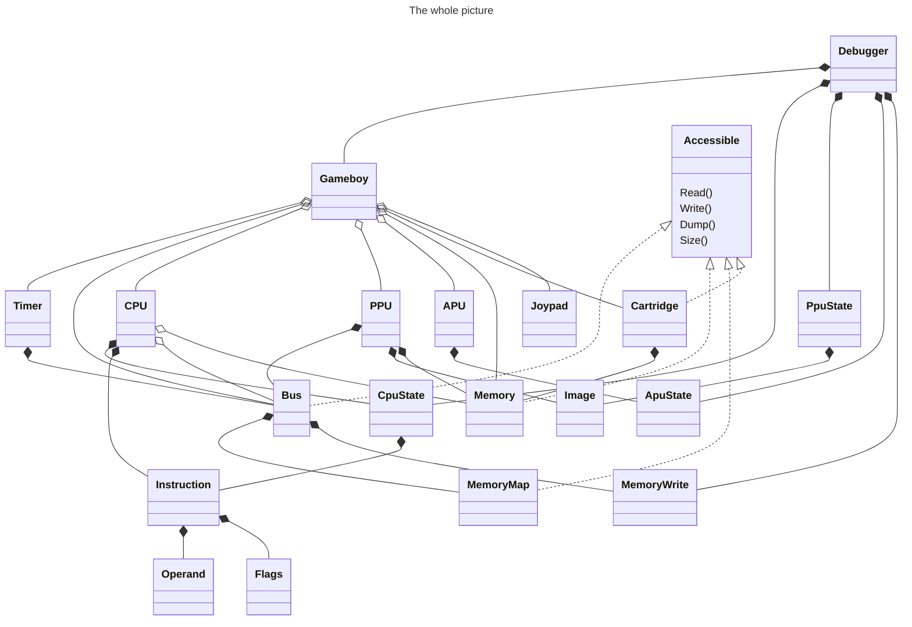
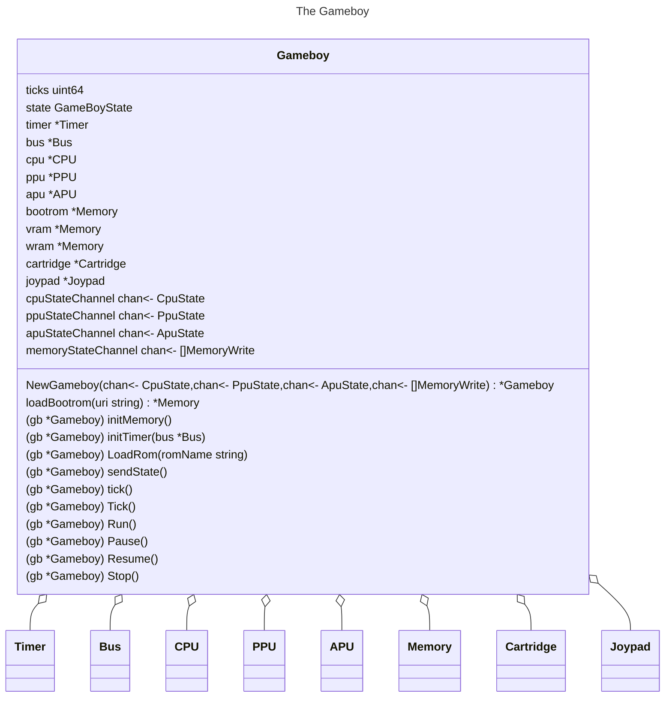
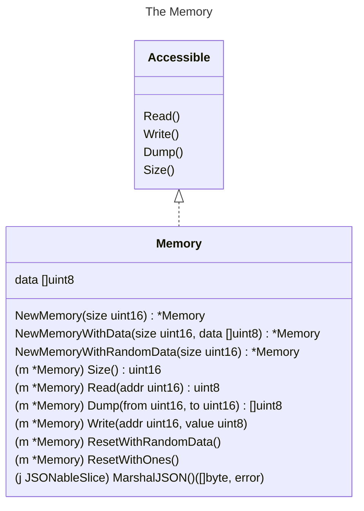

# Gameboy Architecture

In order to get a better grasp on the project's structure, let's walk through a few class diagrams.

## The whole picture

First, let's take a look at the whole picture and show the relations between the classes of the project without their inner details (class members: fields and methods):

## The Gameboy

Let's now focus on the Gameboy:

## The CPU

```mermaid
---
CPU
---

classDiagram
  CPU *-- CpuState
  CPU *-- Instruction
  CPU o-- Bus
  CPU o-- Memory
  class CPU {
    clock uint64
    state CPU_EXECUTION_STATE
    pc               uint16
    sp               uint16
    a                uint8
    f                uint8
    b, c, d, e, h, l uint8
    ir               uint8
    instruction Instruction
    prefixed    bool
    operand     uint16
    offset      uint16
    cpuCycles   uint64
    ime                    bool
    ime_enable_next_cycle  bool
    ime_disable_next_cycle bool
    halted                 bool
    stopped                bool
    bus          *Bus
    io_registers *Memory
    hram         *Memory
    ie           *Memory

    (c *CPU) reset()
    randValue(base int, exponent int) int
    (c *CPU) updatepc()
    (c *CPU) push(value uint16)
    (c *CPU) pop() uint16
    (c *CPU) fetchOpcode() (opcode uint8, prefixed bool)
    (c *CPU) fetchOperandValue(operand Operand) uint16
    (c *CPU) fetch()
    (c *CPU) decode()
    (c *CPU) execute()
    (c *CPU) stall()
    (c *CPU) Tick()
    (c *CPU) getState() CpuState

    (cpu *CPU) handleInterrupts()
    (cpu *CPU) onVBlankInterrupt()
    (cpu *CPU) onLCDStatInterrupt()
    (cpu *CPU) onTimerInterrupt()
    (cpu *CPU) onSerialInterrupt()
    (cpu *CPU) onJoypadInterrupt()

    getFlag(value uint8, position uint8) bool
    setFlag(value uint8, position uint8) uint8
    resetFlag(value uint8, position uint8) uint8
    (c *CPU) getZFlag() bool
    (c *CPU) setZFlag()
    (c *CPU) resetZFlag()
    (c *CPU) getNFlag() bool
    (c *CPU) setNFlag()
    (c *CPU) resetNFlag()
    (c *CPU) getHFlag() bool
    (c *CPU) setHFlag()
    (c *CPU) resetHFlag()
    (c *CPU) getCFlag() bool
    (c *CPU) setCFlag()
    (c *CPU) resetCFlag()
    (c *CPU) getBC() uint16
    (c *CPU) setBC(value uint16)
    (c *CPU) getDE() uint16
    (c *CPU) setDE(value uint16)
    (c *CPU) getHL() uint16
    (c *CPU) setHL(value uint16)
    (c *CPU) GetIEFlag() uint8
    (c *CPU) setIEFlag(value uint16)

    (c *CPU) executeInstruction(instruction Instruction)
    (c *CPU) DI(instruction *Instruction)
    (c *CPU) EI(instruction *Instruction)
    (c *CPU) HALT(instruction *Instruction)
    (c *CPU) NOP(instruction *Instruction)
    (c *CPU) STOP(instruction *Instruction)
    (c *CPU) CALL(instruction *Instruction)
    (c *CPU) JP(instruction *Instruction)
    (c *CPU) JR(instruction *Instruction)
    (c *CPU) RET(instruction *Instruction)
    (c *CPU) RETI(instruction *Instruction)
    (c *CPU) RST(instruction *Instruction)
    (c *CPU) LD(instruction *Instruction)
    (c *CPU) LDH(instruction *Instruction)
    (c *CPU) PUSH(instruction *Instruction)
    (c *CPU) POP(instruction *Instruction)
    (c *CPU) ADC(instruction *Instruction)
    (c *CPU) ADD(instruction *Instruction)
    (c *CPU) AND(instruction *Instruction)
    (c *CPU) CCF(instruction *Instruction)
    (c *CPU) CP(instruction *Instruction)
    (c *CPU) CPL(instruction *Instruction)
    (c *CPU) DAA(instruction *Instruction)
    (c *CPU) DEC(instruction *Instruction)
    (c *CPU) INC(instruction *Instruction)
    (c *CPU) SUB(instruction *Instruction)
    (c *CPU) SBC(instruction *Instruction)
    (c *CPU) SCF(instruction *Instruction)
    (c *CPU) OR(instruction *Instruction)
    (c *CPU) XOR(instruction *Instruction)
    (c *CPU) RLA(instruction *Instruction)
    (c *CPU) RLCA(instruction *Instruction)
    (c *CPU) RRA(instruction *Instruction)
    (c *CPU) RRCA(instruction *Instruction)
    (c *CPU) ILLEGAL(instruction *Instruction)

    (c *CPU) executeCBInstruction(instruction Instruction)
    rotateLeft(value uint8) (uint8, bool)
    (c *CPU) RLC(instruction *Instruction)
    rotateRight(value uint8) (uint8, bool)
    (c *CPU) RRC(instruction *Instruction)
    (c *CPU) RL(instruction *Instruction)
    (c *CPU) RR(instruction *Instruction)
    (c *CPU) SLA(instruction *Instruction)
    (c *CPU) SRA(instruction *Instruction)
    (c *CPU) SWAP(instruction *Instruction)
    (c *CPU) SRL(instruction *Instruction)
    (c *CPU) BIT(instruction *Instruction)
    (c *CPU) RES(instruction *Instruction)
    (c *CPU) SET(instruction *Instruction)
  }
```

## The Memory

The `Memory` class represents a physicla memory of any type: a RAM/ROM chips, Cache Memory on CPU SoC, Virtual Memory on Hard Drive, ... . We will use it to represent the following memories:

- The boot ROM
- The video RAM
- The work RAM
- The cartridge ROM

This implementation is quite flexible as it allows us to create memories of any address space size. On the other hand, each memory address will hold a 8bits value or a byte, here represented by the primitive `uint8`. The whole memory space is represented by a slice of `uint8` values: `data []uint8`.

To instantiate a memory, we can use the following methods:

- `NewMemory(size uint16) *Memory`: creates a new memory of the given size and returns a pointer to it.
- `NewMemoryWithData(size uint16, data []uint8) *Memory`: creates a new memory of the given size and initializes it with the given data.
- `NewMemoryWithRandomData(size uint16) *Memory`: creates a new memory of the given size and initializes it with random data.

The Memory class implements the `Accessible` interface, which defines the following methods:

- `Read(addr uint16) uint8`: reads a byte from the memory at the given address and returns it.
- `Write(addr uint16, value uint8)`: writes a byte to the memory at a given address.
- `Dump(from uint16, to uint16) []uint8`: dumps the memory content from the `from` address to the `to` address.
- `Size() uint16`: returns the size of the memory.

In addition, the `Memory` class implements the following convenience methods:

- `ResetWithRandomData()`: resets the memory with random data (used to simulate the state of the RAM at power on or after resetting the Gameboy).
- `ResetWithOnes()`: resets the memory with all bits set to 1 (TODO: where is it used?).

Finally, the `Memory` class implements the `MarshalJSON` method to allow the memory to be serialized to JSON. This is useful to send the memory state to the debugger which will expose it to the user.

## The Full Diagram

When we put all the classes together, along with their members, we get the following diagram:

```mermaid
---
title: The Full Diagram
---

classDiagram

  APU *-- ApuState
  class APU {
    sound bool
    NewAPU() *APU
    (a *APU) reset()
    (a *APU) getState() ApuState
    (a *APU) Tick()
  }

  Bus *-- MemoryMap
  Bus *-- MemoryWrite
  class Bus {
    memoryMaps []MemoryMap
    MemoryWrites []MemoryWrite
    writeHandlers map[uint16]func(uint8) uint8

    NewBus() *Bus
    (bus *Bus) getMemoryWrites() *[]MemoryWrite
    (bus *Bus) addMemoryWrite(MemoryWrite)
    (bus *Bus) clearMemoryWrites()
    (bus *Bus) AttachMemory(name string, address uint16, memory Accessible)
    (bus *Bus) GetMemoryMaps() []MemoryWrite
    (bus *Bus) findMemory(address uint16) (*MemoryMap, error)
    (bus *Bus) Read(address uint16) uint8
    (bus *Bus) Read16(address uint16) uint16
    (bus *Bus) Dump(address uint16, size uint16) []uint8
    (bus *Bus) write(address uint16, value uint8) error
    (bus *Bus) Write(address uint16, value uint8) error
    (bus *Bus) WriteBlob(addr int, blob []uint8)
    (bus *Bus) DisableBootrom()
    (bus *Bus) timerWrite(address uint16, value uint8)
  }

  Cartridge *-- Memory
  class Cartridge {
    cartridgePath     string
    cartridgeName     string
    rom               *Memory
    header            []uint8
    entry_point       []uint8
    nintendo_logo     []uint8
    title             []uint8
    manufacturer_code []uint8
    cgb_flag          []uint8
    new_licensee_code []uint8
    sgb_flag          []uint8
    cartridge_type    []uint8
    rom_size          []uint8
    ram_size          []uint8
    destination_code  []uint8
    old_licensee_code []uint8
    mask_rom_version  []uint8
    header_checksum   []uint8
    global_checksum   []uint8

    NewCartridge(uri string, name string) *Cartridge
    (c *Cartridge) parseHeader(rom []uint8)
    (c *Cartridge) PrintInfo()
    (c *Cartridge) Read(addr uint16) uint8
    (c *Cartridge) Dump(from uint16, to uint16) []uint8
    (c *Cartridge) Write(addr uint16, value uint8)
    (c *Cartridge) Size() uint16
  }

  CPU *-- CpuState
  CPU *-- Instruction
  CPU o-- Bus
  CPU o-- Memory
  class CPU {
    clock uint64
    state CPU_EXECUTION_STATE
    pc               uint16
    sp               uint16
    a                uint8
    f                uint8
    b, c, d, e, h, l uint8
    ir               uint8
    instruction Instruction
    prefixed    bool
    operand     uint16
    offset      uint16
    cpuCycles   uint64
    ime                    bool
    ime_enable_next_cycle  bool
    ime_disable_next_cycle bool
    halted                 bool
    stopped                bool
    bus          *Bus
    io_registers *Memory
    hram         *Memory
    ie           *Memory

    (c *CPU) reset()
    randValue(base int, exponent int) int
    (c *CPU) updatepc()
    (c *CPU) push(value uint16)
    (c *CPU) pop() uint16
    (c *CPU) fetchOpcode() (opcode uint8, prefixed bool)
    (c *CPU) fetchOperandValue(operand Operand) uint16
    (c *CPU) fetch()
    (c *CPU) decode()
    (c *CPU) execute()
    (c *CPU) stall()
    (c *CPU) Tick()
    (c *CPU) getState() CpuState

    (cpu *CPU) handleInterrupts()
    (cpu *CPU) onVBlankInterrupt()
    (cpu *CPU) onLCDStatInterrupt()
    (cpu *CPU) onTimerInterrupt()
    (cpu *CPU) onSerialInterrupt()
    (cpu *CPU) onJoypadInterrupt()

    getFlag(value uint8, position uint8) bool
    setFlag(value uint8, position uint8) uint8
    resetFlag(value uint8, position uint8) uint8
    (c *CPU) getZFlag() bool
    (c *CPU) setZFlag()
    (c *CPU) resetZFlag()
    (c *CPU) getNFlag() bool
    (c *CPU) setNFlag()
    (c *CPU) resetNFlag()
    (c *CPU) getHFlag() bool
    (c *CPU) setHFlag()
    (c *CPU) resetHFlag()
    (c *CPU) getCFlag() bool
    (c *CPU) setCFlag()
    (c *CPU) resetCFlag()
    (c *CPU) getBC() uint16
    (c *CPU) setBC(value uint16)
    (c *CPU) getDE() uint16
    (c *CPU) setDE(value uint16)
    (c *CPU) getHL() uint16
    (c *CPU) setHL(value uint16)
    (c *CPU) GetIEFlag() uint8
    (c *CPU) setIEFlag(value uint16)

    (c *CPU) executeInstruction(instruction Instruction)
    (c *CPU) DI(instruction *Instruction)
    (c *CPU) EI(instruction *Instruction)
    (c *CPU) HALT(instruction *Instruction)
    (c *CPU) NOP(instruction *Instruction)
    (c *CPU) STOP(instruction *Instruction)
    (c *CPU) CALL(instruction *Instruction)
    (c *CPU) JP(instruction *Instruction)
    (c *CPU) JR(instruction *Instruction)
    (c *CPU) RET(instruction *Instruction)
    (c *CPU) RETI(instruction *Instruction)
    (c *CPU) RST(instruction *Instruction)
    (c *CPU) LD(instruction *Instruction)
    (c *CPU) LDH(instruction *Instruction)
    (c *CPU) PUSH(instruction *Instruction)
    (c *CPU) POP(instruction *Instruction)
    (c *CPU) ADC(instruction *Instruction)
    (c *CPU) ADD(instruction *Instruction)
    (c *CPU) AND(instruction *Instruction)
    (c *CPU) CCF(instruction *Instruction)
    (c *CPU) CP(instruction *Instruction)
    (c *CPU) CPL(instruction *Instruction)
    (c *CPU) DAA(instruction *Instruction)
    (c *CPU) DEC(instruction *Instruction)
    (c *CPU) INC(instruction *Instruction)
    (c *CPU) SUB(instruction *Instruction)
    (c *CPU) SBC(instruction *Instruction)
    (c *CPU) SCF(instruction *Instruction)
    (c *CPU) OR(instruction *Instruction)
    (c *CPU) XOR(instruction *Instruction)
    (c *CPU) RLA(instruction *Instruction)
    (c *CPU) RLCA(instruction *Instruction)
    (c *CPU) RRA(instruction *Instruction)
    (c *CPU) RRCA(instruction *Instruction)
    (c *CPU) ILLEGAL(instruction *Instruction)

    (c *CPU) executeCBInstruction(instruction Instruction)
    rotateLeft(value uint8) (uint8, bool)
    (c *CPU) RLC(instruction *Instruction)
    rotateRight(value uint8) (uint8, bool)
    (c *CPU) RRC(instruction *Instruction)
    (c *CPU) RL(instruction *Instruction)
    (c *CPU) RR(instruction *Instruction)
    (c *CPU) SLA(instruction *Instruction)
    (c *CPU) SRA(instruction *Instruction)
    (c *CPU) SWAP(instruction *Instruction)
    (c *CPU) SRL(instruction *Instruction)
    (c *CPU) BIT(instruction *Instruction)
    (c *CPU) RES(instruction *Instruction)
    (c *CPU) SET(instruction *Instruction)
  }

  CpuState *-- Instruction
  class CpuState {
    CPU_CYCLES    uint64
    PC            uint16
    SP            uint16
    A             uint8
    F             uint8
    Z             bool
    N             bool
    H             bool
    C             bool
    BC            uint16
    DE            uint16
    HL            uint16
    INSTRUCTION   Instruction
    PREFIXED      bool
    IR            uint8
    OPERAND_VALUE uint16
    IE            uint8
    IME           bool
    HALTED        bool
    STOPPED       bool

    func (cs *CpuState) print()
  }

  Debugger *-- Gameboy
  Debugger *-- CpuState
  Debugger *-- PpuState
  Debugger *-- ApuState
  Debugger *-- MemoryWrite

  class Debugger {
    gameboy     *Gameboy
    programFlow *fifo[uint16]
    breakpoints []uint16

    cpuStateQueue    *fifo[CpuState]
    ppuStateQueue    *fifo[PpuState]
    apuStateQueue    *fifo[ApuState]
    memoryStateQueue *fifo[[]MemoryWrite]

    clientCpuStateChannel    chan<- CpuState
    clientPpuStateChannel    chan<- PpuState
    clientApuStateChannel    chan<- ApuState
    clientMemoryStateChannel chan<- []MemoryWrite
    doneChannel              chan bool

    internalCpuStateChannel    chan CpuState
    internalPpuStateChannel    chan PpuState
    internalApuStateChannel    chan ApuState
    internalMemoryStateChannel chan []MemoryWrite

    NewDebugger(chan<- CpuState, chan<- PpuState, chan<- ApuState, chan<- []MemoryWrite,) *Debugger
    (d *Debugger) LoadRom(romName string)
    (d *Debugger) Tick()
    (d *Debugger) Run() chan bool
    (d *Debugger) Pause()
    (d *Debugger) Resume()
    (d *Debugger) Stop()
    (d *Debugger) AddBreakPoint(addr uint16)
    (d *Debugger) RemoveBreakPoint(addr uint16)
    (d *Debugger) GetBreakPoints() []uint16
    (d *Debugger) GetAttachedMemories() []MemoryWrite
    contains(arr []uint16, addr uint16) bool
    (d *Debugger) reset()
    (d *Debugger) listenToGameboyState()
  }

  Gameboy o-- Timer
  Gameboy o-- Bus
  Gameboy o-- CPU
  Gameboy o-- PPU
  Gameboy o-- APU
  Gameboy o-- Memory
  Gameboy o-- Cartridge
  Gameboy o-- Joypad

  class Gameboy {
    ticks uint64
    state GameBoyState

    timer     *Timer
    bus       *Bus
    cpu       *CPU
    ppu       *PPU
    apu       *APU
    bootrom   *Memory
    vram      *Memory
    wram      *Memory
    cartridge *Cartridge
    joypad    *Joypad

    cpuStateChannel    chan<- CpuState
    ppuStateChannel    chan<- PpuState
    apuStateChannel    chan<- ApuState
    memoryStateChannel chan<- []MemoryWrite

    NewGameboy(chan<- CpuState,chan<- PpuState,chan<- ApuState,chan<- []MemoryWrite) *Gameboy
    loadBootrom(uri string) *Memory
    (gb *Gameboy) initMemory()
    (gb *Gameboy) initTimer(bus *Bus)
    (gb *Gameboy) LoadRom(romName string)
    (gb *Gameboy) sendState()
    (gb *Gameboy) tick()
    (gb *Gameboy) Tick()
    (gb *Gameboy) Run()
    (gb *Gameboy) Pause()
    (gb *Gameboy) Resume()
    (gb *Gameboy) Stop()
  }

  Instruction *-- Operand
  Instruction *-- Flags
  class Instruction {
    Mnemonic  string
    Bytes     int
    Cycles    JSONableSlice
    Operands  []Operand
    Immediate bool
    Flags     Flags

    (inst *Instruction) print()
    getBasePath() (string, error)
    LoadJSONOpcodeTable() GameboyInstructionsMap
    GetInstruction(opcode Opcode, prefixed bool) Instruction
  }

  class Operand {
    Name      string
    Bytes     int
    Immediate bool
    Increment bool
    Decrement bool
  }

  class Flags {
    Z string
    N string
    H string
    C string
  }

  class Joypad {
    state uint8
    NewJoypad() *Joypad
    (j *Joypad) Write(value uint8)
  }

  Accessible <|.. Memory
  class Memory {
    data []uint8
    NewMemory(size uint16) *Memory
    NewMemoryWithData(size uint16, data []uint8) *Memory
    NewMemoryWithRandomData(size uint16) *Memory
    (m *Memory) Size() uint16
    (m *Memory) Read(addr uint16) uint8
    (m *Memory) Dump(from uint16, to uint16) []uint8
    (m *Memory) Write(addr uint16, value uint8)
    (m *Memory) ResetWithRandomData()
    (m *Memory) ResetWithOnes()
    (j JSONableSlice) MarshalJSON() ([]byte, error)
  }

  class MemoryWrite {
    Name    string
    Address uint16
    Value   uint8
  }

  class Image {
    _ [256][32]uint8
  }

  PPU *-- Bus
  PPU *-- Image
  PPU *-- Memory
  class PPU {
    bus *Bus
    image Image
    mode  uint8
    ticks uint64
    dotX  uint8
    dotY  uint8
    mode3Length uint
    oam *Memory

    NewPPU(bus *Bus) *PPU
    (p *PPU) reset()
    (p *PPU) Tick()
    (p *PPU) drawBackground()
    (p *PPU) drawWindow()
    (p *PPU) updateSTATRegister_PPUMode()
    (p *PPU) updateLYRegister()
  }

  PpuState *-- Image
  class PpuState {
    MODE  uint8
    DOT_X uint8
    DOT_Y uint8
    IMAGE Image
    (p *PPU) getState() PpuState
  }

  class ApuState {
    SOUND bool
  }

  MemoryMap <|-- Accessible
  class MemoryMap {
    Name string
    Address uint16
    Memory Accessible
  }

  class Accessible {
    Read()
    Write()
    Dump()
    Size()
  }

  Timer *-- Bus
  class Timer {
    bus           *Bus
	  internalClock uint16

    NewTimer(bus *Bus) *Timer
    (t *Timer) Tick()
  }
```

