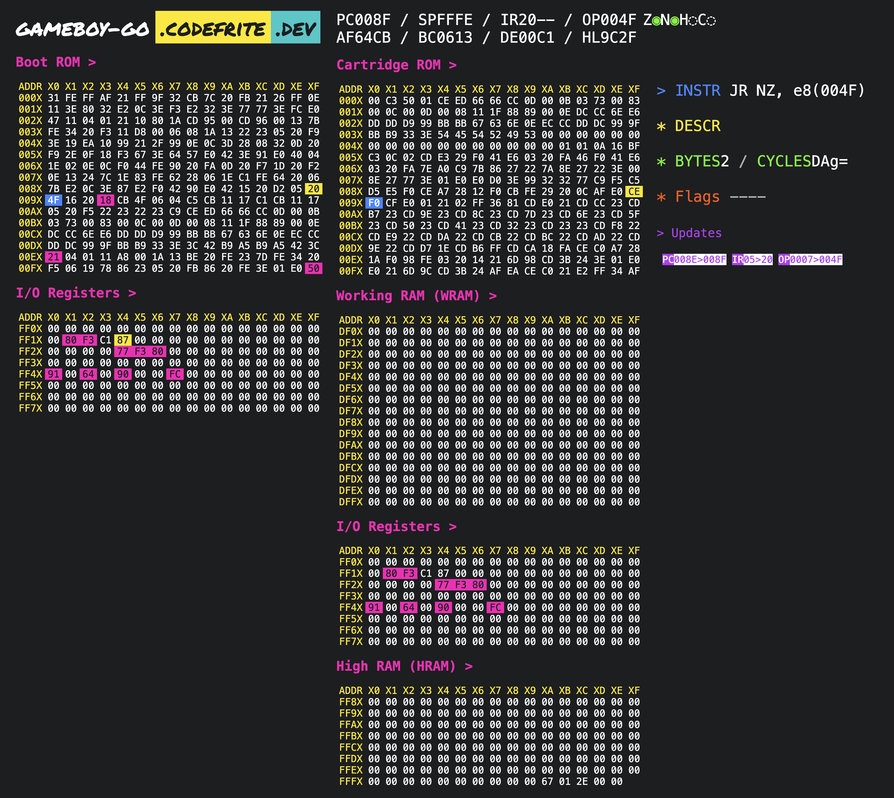

# Blog

In this md file, I will list small tips and tricks that I have learned during the development of this emulator. Tips and tricks, workflows (publish a package on npm, work on a separate branch in git, ...), code snippets, ...

# 13/09/2024 : Long time has passed since it began running

## Issue: the loop of hell

Once again, my emulator was stuck in an infinite loop.

### Analysis

The program is looping. The last instruction is a JR Z condition jump testing the operand DE. I checked which instruction from the loop was supposed to change the value of DE and found that the INC instruction was the only possible option. After inspecting the INC instruction I found out that the operand DE was not handled at all and the INC DE instruction was just doing nothing silently.

### Correction: 

I made 2 changes to the code:
1- I handled the case of the Operand `DE` and
2- I added a default case so that it won't happen in the future.

I then tested the code and it worked as expected. Here is the code snippet:

```go
func (c *CPU) INC(instruction *Instruction) {
  switch instruction.Operands[0].Name {
  case "A":
  ...
  case "B":
  ...
  ...
	case "DE":
		if instruction.Operands[0].Immediate {
			c.setDE(c.getDE() + 1)
		} else if instruction.Operands[0].Increment {
			addr := c.getDE()
			val := c.bus.Read(addr) + 1
			err := c.bus.Write(addr, val)
			if err != nil {
				fmt.Printf("\n> Panic @0x%04X\n", c.PC)
				panic(err)
			}

			if val == 0x00 {
				c.setZFlag()
			} else {
				c.resetZFlag()
			}
			if (val & 0x0F) == 0x00 {
				c.setHFlag()
			} else {
				c.resetHFlag()
			}
		}
	default:
		panic(fmt.Sprintf(">> PANIC >> INC instruction: unknown operand %s", instruction.Operands[0].Name))
	}
	// reset the N flag
	c.resetNFlag()
}
```

### Conclusion

- Add unit tests for all instructions: this error could have been detected through unit testing of the INC instruction
- All switch statements should have a default case to handle unknown cases: we should avoid a branch instruction that does nothing silently

## Infitine loop ... again

And once again it happens

### Analysis

The program is looping between the following instructions:

```go
0x0064			LDH A, (a8)(0000)       ; F0 44 ; wait for vertical-blank period
0x0066			CP 	A,  n8 (90)         ; FE 90 ; value at 0xFF44 used to determine vertical-blank period
0x0068			JR  NZ, e8 (00FA)       ; 20 FA ; jump to 0x0064 (loop) if not at vertical-blank period
```

Apparently these instructions waits for the vblank period to resume the execution of the program. This indicates that I do now need to implement interrupts and in particular the VBlank interrupt. 

### Conclusions

I think that I will need to:

1. Implement the PPU execution loop logic
2. Implement the VBlank interrupt logic in the PPU/CPU (generate and react to the interrupt)
3. Test the interruption instructions one by one because they will be probably used at this stage (DI, EI, RETI, ...)
4. Implement some kind of timer to have an idea of the clock time to know when to render / trigger the VBlank interrupt and basically sync the gameboy with the real time
5. Add the PPU to the bus or a separate bus/mmu combo
6. Run the CPU and the PPU in separate goroutines
7. Render in the front-end the CPU usage:
	- % of time waiting for some interrupts vs % of time executing instructions => stop the perf counter when the CPU is waiting for an interrupt
	- frames per second (fps) of the emulator
8. Render the game image assets in the front-end
9. Render the VRAM graphics in the front-end

# 15/09/2024: CPU Instructions implementation and unit testing

## Achieved so far today

- I have designed and coded unit tests for JR instruction
- I discovered through unit testing a bug that I have fixed an error in the JR instruction that was adding the instruction length to the new value of the PC
- I added a unit test for the JR instruction 
- I added a unit test for the RET instruction
- I added a unit test for the RETI instruction

# 08/10/2024: Reaching the logo checksum quest


