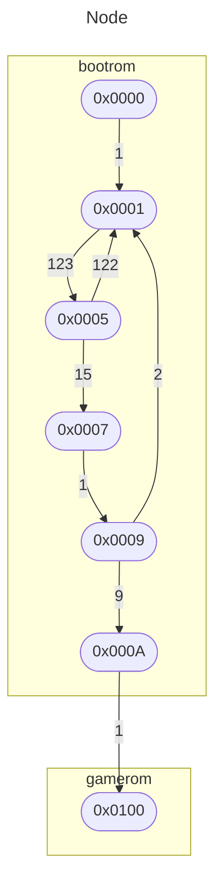

# Execution Flow Chart

More then often during the development of our emulator, we are stuck in a situation where we are not able to understand why our emulator is not working as expected. The issue can come from multiple sources:

- some instructions are not implemented correctly
- cpu interrupts are not triggered or handled correctly
- the ppu rendering is not working as expected
- we are trying to access memory location that is not supposed to be accessed
- an issue with the orchestration of the different components of the emulator
- etc...

Due to the nature of the system under development, it is not always possible to simply add debug logs to understand what is happening. Indeed, the cpu & ppu are driven @4.194304 MHz and do output a lot of data (cpu registers, memory changes, ppu image and registers, etc.) that are not easy to follow in a simple log file.

One way to approach the issue is to develop and use a Debugger. This allows us to pause the execution of the emulator at any time, inspect the state of the different components, and step through the execution of the different instructions.

In other situations, we only want to know if the cpu is stuck in a loop, visiting the same pc addresses over and over again. This is where the Execution Flow Chart comes in handy.

## Mermaid Flow Chart

Instead of creating a flow chart viewer in go, we will make use of `mermaid`. `Mermaid` is a `JavaScript based diagramming and charting tool that renders Markdown-inspired text definitions to create and modify diagrams dynamically`. It offers various types of diagrams, such as flow charts, sequence diagrams, class diagrams, etc. We will use the flow chart diagram to represent the execution flow of the cpu.

The approach will be to:

- record the pc addresses visited by the cpu during the execution of the emulator
- generate the corresponding flow chart using `mermaid` syntax, identifying the graph nodes and edges
- integrate the mermaid flow chart into a log file in markdown format

Let's first begin by sketching an example flow chart diagram that we want to generate. This will help us determine how to record the pc addresses visited by the cpu.

## Desired Execution Flow Chart Look & Feel

The graph below shows a simple flow chart diagram representing the execution flow of the cpu as we are going to implement it.



It has named nodes which contain the pc address visited by the cpu. The edges are labeled with the number of times the cpu transitioned from one pc address to another. It also contains subgraphs to represent the different memory regions (bootrom, gamerom, etc...), which will be considered as a Nice to Have.

## Implementation

Let's talk about how to implement the recording and the generation of the flow chart.

### Recording the Execution Flow

Now comes the question of how to record the pc addresses visited by the cpu. We will use a simple approach:

- use a `[]uint16` to record the unique pc addresses visited by the cpu
- use a `map[int]uint16` to record the order in which the pc addresses were visited
- use a `map[uint16]map[uint16]int` to record the number of times a transition from one pc address to another has been made
- use some kind of struct to list the different memory regions that we want to emphasize

### Generating the Flow Chart

Now that we have recorded, we can generate the flow chart using the `mermaid` syntax. There are basically three steps to follow:

- adding a reference to all the nodes visited at the beginning of the flow chart definition using the `[]uint16` slice
- adding the edges to represent transitions between one pc address to another using the `map[int]uint16` map
- adding a label to the edges representing the number of times the transition has been exercised using the `map[uint16]map[uint16]int` map
- adding the subgraphs to represent the different memory regions using some user defined struct (Nice to Have)

### Creating a new md log file

Once the execution has ended and the data has been recorded, we can create a new md file named `execution_flow_chart_${date}_${time}.md` and save it to the `logs` directory. This file will have the following structure:

```markdown
# Execution Flow Chart

- game: ${game}
- date: ${date}
- time: ${time}

`Insert the mermaid flow chart here`
```

### Where do we put the code

The first question that we should ask ourselves is where to put the code. Here are our options along with the pros and cons:

| #   | Location    | Pros                                                                                    | Cons                                                                                                          |
| --- | ----------- | --------------------------------------------------------------------------------------- | ------------------------------------------------------------------------------------------------------------- |
| 1   | cpu.go      | Easy access to cpu.pc                                                                   | Shouldn't contain the logic to generate the flow chart                                                        |
| 2   | gameboy.go  | Easy access to cpu.pc                                                                   | Cannot be used in debug mode I guess                                                                          |
|     |             | Can be extended to take care of execution flows for other components (memory, ppu, ...) |                                                                                                               |
| 3   | debugger.go | Does not slow the core gameboy-go functionnalities (images, sounds & joypad generation) | Cannot be used in play mode (where we only care about images & sounds produces by the gameboy)                |
| 4   | server.go   | Separates the core gameboy implementation with other tools                              | Introduces complexity in server which should normally only transmit messages in both ways (client <-> server) |

The most logical place to put the code is in the `debugger`. At this point I think I should refactor my code and make the `debugger` a separate package. This will allow me to add more functionalities to the debugger without polluting the core gameboy implementation.

Now that I have moved the `debugger` package to its own directory, my project structure looks like this:

```plaintext
+ gameboy-go          (module)
  + debugger          (package)
    - debugger.go
  + gameboy           (package)
    - gameboy.go
    - cpu.go
    - memory.go
    - ...
  - go.mod
  - go.sum
```

It has only one go module named `gameboy-go` which contains two packages: `debugger` and `gameboy`. The whole module is versioned in the same git repository.

To have access to the gameboy package from the debugger package, I have to import it in the `debugger.go` file:

```go
package debugger

import "github.com/codefrite/gameboy-go/gameboy"

const STATE_QUEUE_MAX_LENGTH = 100

// debugger struct: combination of a gameboy, its internal state and a list of breakpoints set by the user
type Debugger struct {
	// state
	gameboy     *gameboy.Gameboy
  ...
```
