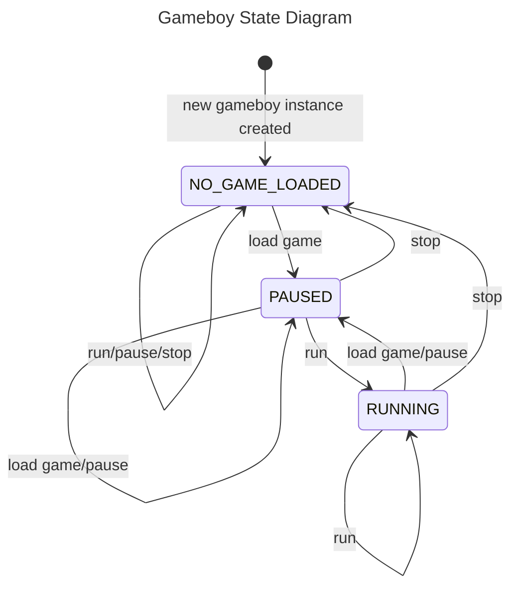

# Gameboy State

The Gameboy state is managed by a `finite state machine` getting its inputs from a channel. Here is the MDP diagram of the Gameboy state machine:



As we can see, the Gameboy can be in one of the following states:

- `NO_GAME_LOADED`: no game is loaded and the Gameboy is paused
- `PAUSED`: A game is loaded but the Gameboy clock is not ticking: the execution flow is stopped and no further instructions are being executed by the CPU, no sound is being played, no graphics are being rendered.
- `RUNNING`: A game is loaded and the Gameboy clock is ticking: the execution flow is running and the CPU is executing instructions, sound is being played and graphics are being rendered

We can see its implementation in the `Gameboy` struct:

```go
const (
  ...
	// Gameboy states
	GB_STATE_NO_GAME_LOADED GameBoyState = "no game loaded" // no game loaded & gameboy paused
	GB_STATE_PAUSED         GameBoyState = "paused"         // game loaded & gameboy paused
	GB_STATE_RUNNING        GameBoyState = "running"        // game loaded & gameboy running

	// Gameboy State's Actions
	GB_ACTION_LOAD_GAME GameBoyAction = "load"   // load a game
	GB_ACTION_RUN       GameBoyAction = "run"    // run the gameboy if it has a game loaded
	GB_ACTION_PAUSE     GameBoyAction = "pause"  // pause the gameboy
	GB_ACTION_RESET     GameBoyAction = "reset"  // reset the gameboy
)

type GameBoyState string
type GameBoyAction string
type GameboyActionMessage struct {
	Action  GameBoyAction
	payload interface{}
}

type Gameboy struct {
  state GameBoyState // current state of the gameboy
	gameboyActionChannel <-chan GameboyActionMessage // responsible to run, pause and stop the gameboy
  ...
}

// create a new gameboy struct
func NewGameboy(
	gameboyActionChannel <-chan GameboyActionMessage,
	...
) *Gameboy {

	// instantiate the components bus, cpu, ppu & apu
	...
	// load the bootrom once for all
	...
	// create the gameboy struct
  ...
	// initialize memories and timer
  ...

  // start the state machine listener
	go gb.stateMachineListener()

	return gb
}
...

// reset the gameboy state:
// - reset the gameboy state to "GB_STATE_NO_GAME_LOADED"
// - reset the ticks count and the timer
// - reset the bus and initialize the memories
// - reset the cpu, ppu and apu states
func (gb *Gameboy) reset() {
	// reset the gameboy state
	gb.state = GB_STATE_NO_GAME_LOADED

	// reset the ticks count and the timer
	gb.ticks = 0
	gb.timer.reset()

	// reset the bus and initialize the memories
	gb.bus.reset()
	gb.initMemory()

	// reset the cpu, ppu and apu states
	gb.cpu.reset()
	gb.ppu.reset()
	gb.apu.reset()
}

// listen to the gameboy state actions channel
func (gb *Gameboy) stateMachineListener() {
	gb.state = GB_STATE_NO_GAME_LOADED
	for {
		select {
		case state := <-gb.gameboyActionChannel:
			switch state.Action {
			case GB_ACTION_LOAD_GAME:
				gb.LoadRom(state.payload.(string))
			case GB_ACTION_PAUSE:
				if gb.state == GB_STATE_RUNNING {
					gb.state = GB_STATE_PAUSED
				}
			case GB_ACTION_RUN:
				if gb.state == GB_STATE_PAUSED {
					gb.state = GB_STATE_RUNNING
					go gb.run()
				}
			case GB_ACTION_RESET:
        gb.reset()
				gb.state = GB_STATE_NO_GAME_LOADED
				return
			}
		}
	}
}
```

As shown in the code, when a new instance of the `Gameboy` struct is created, the state is set to `GB_STATE_NO_GAME_LOADED` and the `stateMachineListener` goroutine is started. This goroutine listens to the `gameboyActionChannel` channel and changes the state of the Gameboy accordingly. According to the MDP, it will load a game, pause, run or stop the Gameboy.

When the new state is `GB_STATE_RUNNING`, the `run` method is called in a new goroutine. This method is responsible for running the Gameboy and is implemented as follows:

```go

```
