# Go Project Structure

My gameboy emulator project has multiple components to it:

- gameboy-go: This module contains the core gameboy implementation. It is responsible for the emulation of the gameboy CPU, PPU, Memories, Cartridge, etc. It also includes a debugger as well as some data structures to help with the state recording in the debugger.
- gameboy-go-next: This module contains the implementation in TypeScript of the gameboy interface: it allows to play gameboy games, render the image and sound, interact with the joypad, etc. It also has a debugger route that allows to step though the gameboy instructions and inspect the memory and registers.
- server-go: This module contains the implementation of the server that will serve the gameboy-go-next files and handle the websocket communication between the gameboy-go-next and the gameboy-go.

Currently, these 3 components are versioned separately in their dedicated git repositories. This approach has pros and cons. The main advantage is that it allows to have a clear separation of concerns and to have a clear versioning of each component. The main disadvantage is that it makes it harder to maintain the project as a whole and to keep the versions in sync.

Indeed, the gameboy-go core implementation and the server-go could be versioned together in the same go module that would have a master go.mod and two submodules for the gameboy-go and server-go. This would allow to tag a master version that would match different versions of gameboy-go & the server that are meant to work together.

## Submodules

The project would have the following structure:

```mermaid
graph TD
  root["📁 gameboy-emulator (root-module)"]
  gomod["📄 go.mod"]
  submoduleA["📁 gameboy-go (sub-module)"]
  packageA1["&#128230; gameboy (package)"]
  packageA2["&#128230; debugger (package)"]
  packageA3["&#128230; datastructure (package)"]
  gomodA["📄 go.mod"]
  submoduleB["📁 server-go (sub-module)"]
  gomodB["📄 go.mod"]

  root --> gomod
  root --> submoduleA
  submoduleA --> gomodA
  submoduleA --> packageA1
  submoduleA --> packageA2
  submoduleA --> packageA3
  root --> submoduleB
  submoduleB --> gomodB
```

