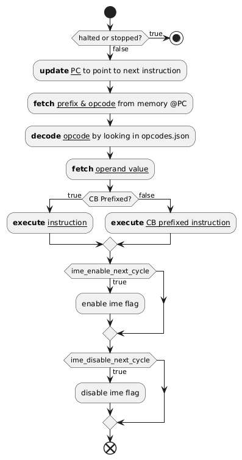
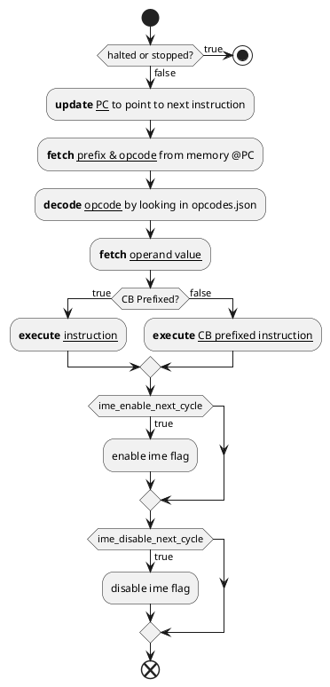
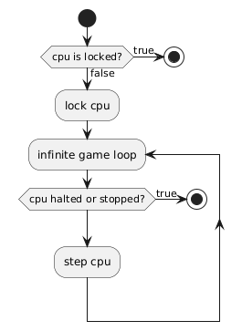
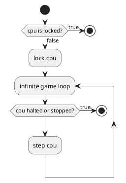

# Running Modes

Depending on the use case, the gameboy can be run in different modes. The following modes are supported:

| Initiator | Mode                      | Description                                                                                                            |
| --------- | ------------------------- | ---------------------------------------------------------------------------------------------------------------------- |
| CPU       | Tick                      | The CPU advances 1 in the execution: fetch, decode or execute. In // checks for interrupts                             |
|           | Step                      | The CPU executes 1 full instruction and then stops (ticks until cpu reaches the next fetch cycle without executing it) |
|           | Run                       | The CPU executes instructions one after the other until halted or stopped                                              |
| Gameboy   | Tick                      | The gameboy runs one tick and then stops (cpu, ppu, apu & timer)                                                       |
|           | Step                      | The gameboy ticks all components until cpu reaches the next fetch cycle                                                |
|           | Run                       | The gameboy runs until it is stopped or halted                                                                         |
| Debugger  | StepUntilCondition        | The gameboy runs one tick and then stops.                                                                              |
|           | RunUntilCondition         | The gameboy runs 3 ticks / 1 instruction and then stops.                                                               |
|           | Run                       | The gameboy runs until it is stopped.                                                                                  |
|           | RunUntilPC                | The gameboy runs until the program counter reaches a specific value.                                                   |
|           | RunUntilRegisterCondition | The gameboy runs until a specific register reaches a specific value.                                                   |
|           | RunUntilMemoryCondition   | The gameboy runs until a specific memory address is set to a specific value.                                           |
|           | RunUntilNextFrame         | The gameboy runs until the next frame is rendered.                                                                     |

The following sections will describe the different modes in more detail.

## CPU Modes

### Step

In this mode, the CPU fetches the next instruction, decodes it, fetches the operands and finally executes the instruction. After the instruction is executed, the CPU stops. This mode is useful for debugging purposes. Here is its implementation:

```go

// Execute one cycle of the CPU: fetch, decode and execute the next instruction
func (c *CPU) Step() error {

	// return if the CPU is halted or stopped
	if c.halted || c.stopped {
		return nil
	}

	// update the pc and reset the offset
	c.updatepc()
	c.offset = 0

	// reset the prefixed flag
	c.prefixed = false

	// Store the opcode in the instruction register & prefix flag
	opCode, prefixed := c.fetchOpcode()
	c.prefixed = prefixed
	c.ir = opCode

	// Decode the instruction
	// get instruction from opcodes.json file with IR used as key
	instruction := GetInstruction(Opcode(fmt.Sprintf("0x%02X", c.ir)), c.prefixed)
	c.instruction = instruction
	// get the operands of the instruction
	operands := instruction.Operands
	// fetch the last operand value
	idx := len(operands) - 1
	if idx >= 0 {
		c.operand = c.fetchOperandValue(operands[idx])
	}

	// Handle the IME
	if c.ime_enable_next_cycle {
		// Execute the instruction
		if !c.prefixed {
			c.executeInstruction(instruction)
		} else {
			c.executeCBInstruction(instruction)
		}
		// enable the IME
		c.ime = true
		c.ime_enable_next_cycle = false
	} else if c.ime_disable_next_cycle {
		// Execute the instruction
		if !c.prefixed {
			c.executeInstruction(instruction)
		} else {
			c.executeCBInstruction(instruction)
		}
		// disable the IME
		c.ime = false
		c.ime_disable_next_cycle = false
	} else {
		// Execute the instruction
		if !c.prefixed {
			c.executeInstruction(instruction)
		} else {
			c.executeCBInstruction(instruction)
		}
	}

	return nil
}
```

PlantUML Activity Diagram:





### Run

In this mode, the CPU runs instructions one after the other until it is halted or stopped. This mode is useful for running the gameboy. Here is its implementation:

```go
// Run the CPU
func (c *CPU) Run() {
	// return if CPU is locked, otherwise lock CPU and run
	if c.state == CPU_EXECUTION_STATE_LOCKED {
		fmt.Println("CPU is locked")
		return
	} else {
		c.state = CPU_EXECUTION_STATE_LOCKED
	}
	for {
		if c.halted {
			// if the CPU is halted, wait for an interrupt to wake it up
			// TODO: implement the interrupt handling
			// ! for the moment, we will break the loop to avoid an infinite loop
			break
		}
		if c.stopped {
			// if the CPU is stopped, wait for an interrupt from the joypad
			break
		}
		// Execute the next instruction
		if err := c.Step(); err != nil {
			panic(err)
		}
	}

	// unlock the CPU
	c.state = CPU_EXECUTION_STATE_FREE
}
```



PlantUML Activity Diagram:



## Gameboy Modes

### Tick

In this mode, the gameboy runs one tick and then stops. Since the gameboy runs at 4.194304 MHz, one tick is equivalent to 1/4194304 seconds. During this time, the CPU will virtually execute one of the steps of the instruction cycle : fetch, decode, execute. As it is currently coded, the CPU executes all 3 steps every 3 clock cycles by checking if the tick count is a multiple of 3.
